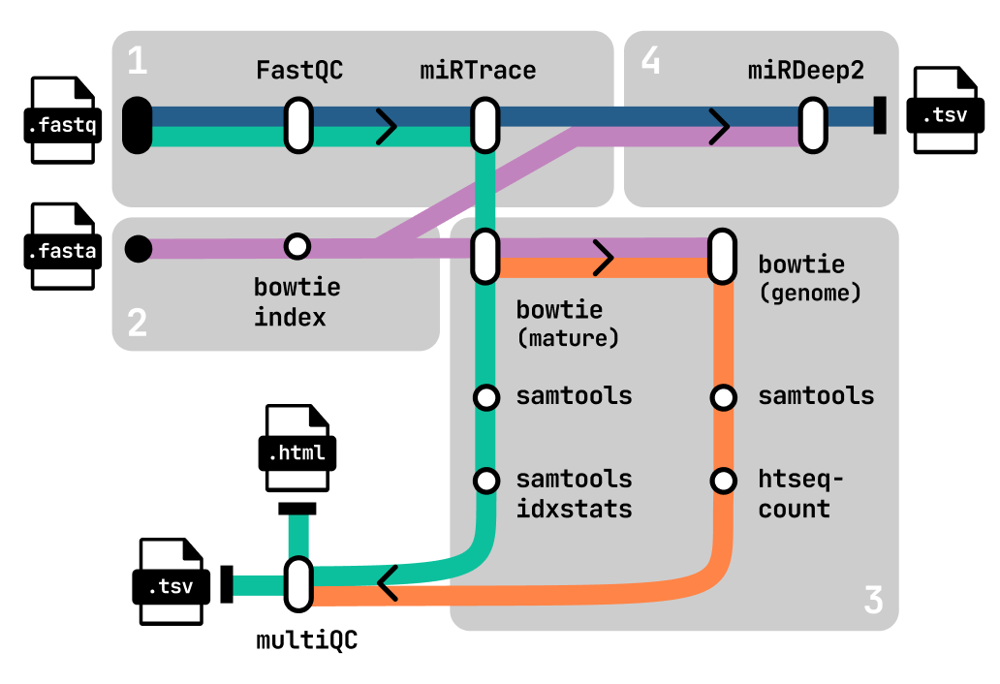

# nf-miRNA

## 1. Introduction

**nf-mirna** is a complete pipeline to process, align and analyse deep sequencing miRNA reads. This pipeline is based on the nf-core pipeline [smrnaseq](https://nf-co.re/smrnaseq/2.4.0/) v2.4.0.

This pipeline is built using [Nextflow](https://www.nextflow.io/), a workflow tool to run tasks across multiple compute infrastructures. It can use Docker/Singularity making installation and results highly reproducible.



## 2. Pipeline Summary

1. Quality check and trimming
    - Raw read QC (`fastqc`)
    - Adapter trimming, miRNA QC, and FASTQ -> FASTA conversion (`miRTrace`)
2. miRNA quantification
    - Alignment against miRNA mature reference (`bowtie`)
    - Alignment of unmapped reads to genome reference (`bowtie`) (Optional)
3. Novel miRNAs discovery
    - Mapping against reference genome and novel miRNA discovery with the miRDeep2 module (`miRDeep2`) (Optional)
4. Summary results and QCs (`multiqc`)
5. Summary of pipeline execution (`nextflow`)

## 3. Usage

You can test the pipeline as follows:

```bash
nextflow run nf-mirna \
    -profile test,singularity \
    --outdir <OUTDIR>
```

In order to use the pipeline with your own data, first prepare a `samplesheet.csv` with yout input data that looks as follows:

```
sample,fastq_1
sample_1,10004_S37_R1_001.fastq.gz
sample_2,1006_S18_R1_001.fastq.gz
sample_3,4025_S11_R1_001.fastq.gz
sample_4,2001_S25_R1_001.fastq.gz
```

Each row represents a fastq file (single-end). Now, you can run the pipeline using:

```bash
nextflow run nf-mirna \
    -profile <singularity,docker>,<protocol> ... \
    --input samplesheet.csv \
    --genome 'path/to/genome.fa' \
    --genome_index 'path/to/genome_index[dir|.tar.gz]'
    --mirna_gtf 'path/to/mirna.gtf' \
    --outdir <OUTDIR>
```
